# Hospital Management System — Insurance Module Documentation

**Version:** 1.0  
**Author:** Siddhant Sangram Shinde  
**Date:** 14 May 2026  
**Branch:** `feature/insurance-module`

---

## Table of Contents

1. [Introduction](#1-introduction)
2. [Objectives](#2-objectives)
3. [Scope](#3-scope)
4. [Features](#4-features)
5. [User Roles & Permissions](#5-user-roles--permissions)
6. [System Architecture](#6-system-architecture)
7. [Database Schema](#7-database-schema)
8. [Entity Relationship Diagram](#8-entity-relationship-diagram)
9. [API Endpoints](#9-api-endpoints)
10. [Frontend Components](#10-frontend-components)
11. [Workflows](#11-workflows)
12. [Diagrams](#12-diagrams)
13. [Integration Points](#13-integration-points)
14. [Technology Stack](#14-technology-stack)
15. [Setup & Configuration](#15-setup--configuration)
16. [Conclusion](#16-conclusion)

---

## 1. Introduction

The Insurance Module is a core component of the Hospital Management System (HMS) that manages the complete insurance lifecycle for hospital patients. It handles both **private insurance policies** (linked to Third Party Administrators and Insurance Companies) and **government health schemes** (PM-JAY/Ayushman Bharat, CGHS, ESIC, MJPJAY).

The module automates the entire insurance workflow — from policy registration and verification through pre-authorization requests, cashless/reimbursement claims processing, document management, and integration with the hospital's Billing Module for insurance-billing splits.

It supports **dynamic provider-specific forms** through a flexible form rendering engine, allowing the system to generate insurer-specific pre-authorization and claim forms (IRDAI Standard, PM-JAY, CGHS) without schema changes.

---

## 2. Objectives

| # | Objective |
|---|---|
| 1 | Automate insurance policy registration and verification for patients |
| 2 | Support both private insurance (via TPAs) and government health schemes |
| 3 | Streamline pre-authorization requests for planned admissions/procedures |
| 4 | Enable cashless and reimbursement claim processing with full audit trails |
| 5 | Manage medical document uploads and retrieval for claims |
| 6 | Integrate insurance deductions into the hospital billing system |
| 7 | Maintain master data for TPAs, insurance companies, and official forms |
| 8 | Provide real-time dashboard analytics (claims stats, settlement amounts) |
| 9 | Support role-based access control for different hospital staff |
| 10 | Reduce manual paperwork and improve claim turnaround time |

---

## 3. Scope

### In Scope

- Private insurance policy management (registration, verification, updates)
- Government scheme enrollment (PM-JAY, CGHS, ESIC, MJPJAY)
- Pre-authorization request lifecycle management
- Cashless claim processing
- Reimbursement claim processing
- Medical document upload and management
- Insurance-billing split calculation and mapping
- TPA master data management
- Insurance company master data management
- Official insurer forms registry
- Provider-specific dynamic form rendering
- Dashboard statistics and reporting
- Cross-module integration (Reception, Billing, Admin)

### Out of Scope

- Direct integration with insurer/TPA portals (manual entry supported)
- Real-time claim status updates from insurers
- Insurance premium payment collection
- Patient insurance eligibility verification via external APIs
- Policy renewal automation
- IRDAI regulatory reporting
- Insurance fraud detection
- Patient-facing insurance portal

---

## 4. Features

### 4.1 Policy Management (Private Insurance)

Register and manage private health insurance policies linked to patients.

- Register new insurance policy with patient association
- Support plan types: Individual, Family Floater, Group
- Capture sub-limits (room rent cap, ICU cap, procedure cap)
- Track co-pay percentage, deductibles, and waiting periods
- Policy verification workflow (Not Verified → Verified — Active / Expired)
- Soft-delete with audit trail
- Link policies to TPAs and Insurance Companies

**API:** `POST /api/insurance/policies`, `GET /:patientId`, `PUT /:policyId`, `PATCH /:policyId/verify`, `DELETE /:policyId`

### 4.2 Government Scheme Management

Enroll patients under government health schemes with scheme-specific data.

- Support 4 schemes: PM-JAY, CGHS, ESIC, MJPJAY
- Capture scheme-specific identifiers (ABHA number, Ayushman card, CGHS beneficiary ID, ESIC IP number)
- Ration card validation for PM-JAY eligibility
- Dual-scheme support (primary scheme flag)
- Verification workflow matching policy verification

**API:** `POST /api/insurance/schemes`, `GET /:patientId`, `PUT /:schemeId`, `PATCH /:schemeId/verify`

### 4.3 Pre-Authorization Management

Request and track pre-authorization for planned procedures and admissions.

- Submit pre-auth requests with diagnosis (ICD-10), proposed treatment, estimated cost
- Status lifecycle: Draft → Submitted → Under Review → Query Raised → Approved → Rejected → Expired
- Query/response tracking between hospital and insurer
- Authorization number and validity date management
- Support for dynamic provider-specific forms (IRDAI, PM-JAY, CGHS)
- Status history audit trail

**API:** `POST /api/insurance/pre-auth`, `GET /`, `GET /:id`, `PATCH /:id/status`

### 4.4 Cashless Claims Management

Process cashless claims where the insurer settles directly with the hospital.

- Auto-generate unique claim numbers (CLM-YYYYMMDD-NNNN)
- Link claims to policies, schemes, and pre-auth requests
- 11-stage status lifecycle from Draft to Settled
- Document checklist tracking (9 document types)
- Settlement details (UTR number, date, bank reference)
- Financial breakdown: total bill, claimed amount, approved amount, settled amount
- Co-pay, deductible, and non-covered amount tracking
- Status history with full audit trail

**API:** `POST /api/insurance/claims`, `GET /`, `GET /:id`, `PATCH /:id/status`, `GET /dashboard-stats`

### 4.5 Reimbursement Claims

Handle reimbursement claims where the patient pays first and claims later.

- Distinct claim type (Reimbursement vs Cashless)
- Same 11-stage status lifecycle
- Supports all document types for claim submission
- Tracks settlement details for bank transfers

### 4.6 TPA Management

Manage Third Party Administrator master data.

- CRUD operations for TPA records
- Track IRDAI license numbers and portal URLs
- Pre-auth TAT and claim TAT tracking
- Link TPAs to insurance companies (many-to-many)

**API:** `GET/POST /api/insurance/master-data/tpas`

### 4.7 Billing Integration

Calculate and track insurance-billing splits for the Billing Module.

- Insurance deduction calculation (co-pay, deductible, non-covered items)
- Patient payable amount computation
- Manual override support with audit trail
- Summary API for Billing Module consumption

**API:** `GET /api/insurance/billing/summary/:patientId`, `POST /api/insurance/billing/mapping`

### 4.8 Document Management

Upload and manage medical documents for claims and pre-auth requests.

- Support PDF, JPEG, PNG files (max 5MB)
- 11 document categories (Admission Form, Discharge Summary, Investigation Reports, etc.)
- Soft-delete with audit trail
- Link documents to claims or pre-auth requests

**API:** `POST /api/insurance/documents/upload`, `GET /claim/:claimId`, `GET /pre-auth/:preAuthId`, `DELETE /:docId`

### 4.9 Official Forms Registry

Maintain a directory of official insurer/TPA claim forms.

- Form types: Pre-Auth, Claim, Reimbursement, Discharge
- Track form versions and deprecation
- Store download URLs (forms not hosted in-system)

**API:** `GET/POST /api/insurance/master-data/forms`

### 4.10 Insurance Dashboard

Real-time analytics for the insurance desk.

- Total Claims count
- Approved Claims count
- Pending Claims count
- Total Settled Amount
- Claims list with status filtering and pagination

**API:** `GET /api/insurance/claims/dashboard-stats`

### 4.11 Provider-Specific Dynamic Forms

Render insurer-specific official forms without schema changes.

- 3 form templates: IRDAI Standard, PM-JAY, CGHS
- Dynamic field rendering (text, number, select, textarea, checkbox, file)
- Auto-fill patient data from system
- Print-to-PDF support
- Form data stored in flexible Map fields

**Frontend:** `ProviderFormRenderer.jsx`, `insuranceFormTemplates.js`

### 4.12 Notifications

Notify insurance desk officers about claim updates and pending tasks.

- Notification bell with unread count badge
- Polling every 30 seconds
- Mark-as-read functionality
- Currently mock data (real triggers planned)

**API:** `GET /api/insurance/notifications`, `PUT /:id/read`

### 4.13 Cross-Module Integration

The Insurance Module integrates with multiple hospital departments.

- **Reception → Insurance:** Auto-creates Draft pre-auth when patient has insurance
- **Insurance → Billing:** Provides insurance split data (InsuranceSplitCard)
- **Admin → Insurance:** Manages TPA and Insurance Company master data

---

## 5. User Roles & Permissions

| Role | View Policies | Register Policy | Verify Policy | File Pre-Auth | Process Claims | Upload Documents | Manage TPA/Insurer | View Dashboard | Manage Schemes |
|---|---|---|---|---|---|---|---|---|---|
| **Insurance Desk Officer** | ✅ | ✅ | ✅ | ✅ | ✅ | ✅ | ❌ | ✅ | ✅ |
| **Admin** | ✅ | ❌ | ✅ | ❌ | ❌ | ❌ | ✅ | ✅ | ❌ |
| **Receptionist** | ✅ | ❌ | ❌ | ✅ (auto) | ❌ | ❌ | ❌ | ❌ | ❌ |
| **Billing Officer** | ✅ (read) | ❌ | ❌ | ❌ | ❌ | ❌ | ❌ | ❌ | ❌ |
| **Doctor** | ✅ (read) | ❌ | ❌ | ✅ (initiate) | ❌ | ✅ (clinical docs) | ❌ | ❌ | ❌ |
| **Patient** | ✅ (own only) | ❌ | ❌ | ❌ | ❌ | ❌ | ❌ | ❌ | ❌ |

> **Note:** Role-Based Access Control (RBAC) middleware is planned but not yet enforced. All endpoints are currently open.

---

## 6. System Architecture

### 6.1 HMS Full System Architecture

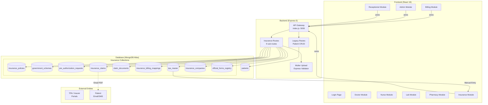

### 6.2 Insurance Module Architecture

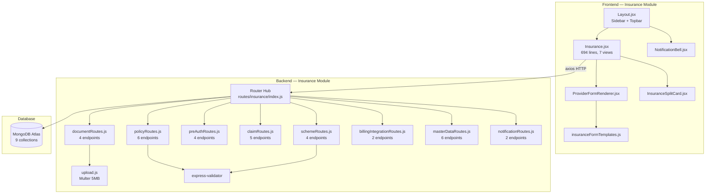

---

## 7. Database Schema

The Insurance Module uses **9 MongoDB collections** stored in a MongoDB Atlas sharded cluster.

### 7.1 InsurancePolicy (`insurance_policies`)

| Field | Type | Required | Description |
|---|---|---|---|
| `patientId` | ObjectId (ref: Patient) | ✅ | Link to patient |
| `insuranceType` | Enum: `Private`, `Government` | ✅ | Type of insurance |
| `providerName` | String | ✅ | Insurer name |
| `policyNumber` | String | ✅ | Unique policy number |
| `planType` | Enum: `Individual`, `Family Floater`, `Group` | ✅ | Plan category |
| `sumInsured` | Number | ✅ | Maximum coverage amount |
| `subLimits.roomRentCap` | Number | | Room rent limit per day |
| `subLimits.icuCap` | Number | | ICU charge limit per day |
| `subLimits.procedureCap` | Number | | Per-procedure limit |
| `coPayPercentage` | Number | | Patient co-pay % (default: 0) |
| `deductible` | Number | | Deductible amount (default: 0) |
| `tpaId` | ObjectId (ref: TPAMaster) | | Linked TPA |
| `insurerCompanyId` | ObjectId (ref: InsuranceCompany) | | Linked insurer |
| `policyStartDate` | Date | ✅ | Coverage start |
| `policyEndDate` | Date | ✅ | Coverage end |
| `isNetworkHospital` | Boolean | | Hospital in insurer network? |
| `waitingPeriodNotes` | String | | Waiting period details |
| `verificationStatus` | Enum | | `Not Verified`, `Verified — Active`, `Verified — Expired`, `Verification Failed` |
| `verifiedBy` | ObjectId (ref: User) | | Verifying officer |
| `verifiedAt` | Date | | Verification timestamp |
| `isActive` | Boolean | | Soft-delete flag |

### 7.2 GovernmentScheme (`government_schemes`)

| Field | Type | Required | Description |
|---|---|---|---|
| `patientId` | ObjectId (ref: Patient) | ✅ | Link to patient |
| `schemeName` | Enum: `PM-JAY`, `CGHS`, `ESIC`, `MJPJAY`, `Other` | ✅ | Scheme identifier |
| `schemeSpecificData.abhaNumber` | String | | ABHA Health ID |
| `schemeSpecificData.ayushmanCardNumber` | String | | PM-JAY card number |
| `schemeSpecificData.familyId` | String | | Family identifier |
| `schemeSpecificData.hbpCode` | String | | Health Benefit Package code |
| `schemeSpecificData.cghsBeneficiaryId` | String | | CGHS beneficiary ID |
| `schemeSpecificData.cghsCardType` | Enum | | `Serving`, `Pensioner`, `Dependent` |
| `schemeSpecificData.referralReference` | String | | CGHS referral number |
| `schemeSpecificData.esicIpNumber` | String | | ESIC IP number |
| `schemeSpecificData.employerName` | String | | ESIC employer |
| `schemeSpecificData.dispensaryName` | String | | ESIC dispensary |
| `schemeSpecificData.rationCardNumber` | String | | PM-JAY eligibility |
| `schemeSpecificData.rationCardCategory` | Enum | | `Yellow`, `Orange`, `AAY`, `Annapurna` |
| `schemeSpecificData.sevenTwelveExtract` | String | | Land record reference |
| `schemeSpecificData.arogyamitraVerified` | Boolean | | Arogya Mitra verified? |
| `verificationStatus` | Enum | | Same as Policy |
| `primaryScheme` | Boolean | | For dual-eligible patients |
| `isActive` | Boolean | | Soft-delete flag |

### 7.3 PreAuthRequest (`pre_authorization_requests`)

| Field | Type | Required | Description |
|---|---|---|---|
| `patientId` | ObjectId (ref: Patient) | ✅ | Link to patient |
| `policyId` | ObjectId (ref: InsurancePolicy) | | Private policy reference |
| `schemeId` | ObjectId (ref: GovernmentScheme) | | Govt scheme reference |
| `admittingDoctor` | String | ✅ | Treating doctor name |
| `expectedAdmissionDate` | Date | | Planned admission |
| `expectedDischargeDate` | Date | | Planned discharge |
| `diagnosis` | String | ✅ | Medical diagnosis |
| `icd10Code` | String | | ICD-10 classification |
| `proposedTreatment` | String | ✅ | Planned procedure |
| `estimatedCost` | Number | ✅ | Estimated treatment cost |
| `status` | Enum | ✅ | `Draft`, `Submitted`, `Under Review`, `Query Raised`, `Approved`, `Enhancement Requested`, `Rejected`, `Expired` |
| `approvedAmount` | Number | | Insurer approved amount |
| `authorizationNumber` | String | | Auth reference number |
| `validityDate` | Date | | Auth expiry date |
| `queryDetails` | Array | | Query/response tracking |
| `statusHistory` | Array | | Full status audit trail |
| `documents` | [ObjectId] (ref: ClaimDocument) | | Attached documents |
| `providerTemplateUsed` | String | | e.g. `IRDAI_STANDARD`, `PM_JAY` |
| `providerSpecificData` | Map of Mixed | | Dynamic form field values |

### 7.4 InsuranceClaim (`insurance_claims`)

| Field | Type | Required | Description |
|---|---|---|---|
| `claimNumber` | String (unique) | ✅ | Auto-generated: CLM-YYYYMMDD-NNNN |
| `patientId` | ObjectId (ref: Patient) | ✅ | Link to patient |
| `policyId` | ObjectId (ref: InsurancePolicy) | | Policy reference |
| `schemeId` | ObjectId (ref: GovernmentScheme) | | Scheme reference |
| `preAuthId` | ObjectId (ref: PreAuthRequest) | | Pre-auth reference |
| `claimType` | Enum: `Cashless`, `Reimbursement` | ✅ | Claim category |
| `admissionDate` | Date | ✅ | Admission date |
| `dischargeDate` | Date | | Discharge date |
| `diagnosis` | String | ✅ | Diagnosis |
| `icd10Code` | String | | ICD-10 code |
| `proceduresPerformed` | String | | Procedures done |
| `treatingDoctor` | String | | Doctor name |
| `totalBillAmount` | Number | | Gross hospital bill |
| `claimedAmount` | Number | | Amount claimed |
| `approvedAmount` | Number | | Insurer approved |
| `settledAmount` | Number | | Actual amount received |
| `coPayAmount` | Number | | Patient co-pay |
| `deductibleAmount` | Number | | Deductible applied |
| `nonCoveredAmount` | Number | | Non-covered charges |
| `patientPayable` | Number | | Net patient liability |
| `status` | Enum | ✅ | 11-stage lifecycle |
| `settlementDetails` | Subdocument | | UTR, date, bank reference |
| `rejectionReason` | String | | Rejection explanation |
| `statusHistory` | Array | | Full audit trail |
| `documents` | [ObjectId] (ref: ClaimDocument) | | Attached documents |
| `documentChecklist` | Subdocument | | 9 boolean flags |
| `providerTemplateUsed` | String | | Dynamic form template |
| `providerSpecificData` | Map of Mixed | | Dynamic form values |

### 7.5 InsuranceBillingMapping (`insurance_billing_mappings`)

| Field | Type | Required | Description |
|---|---|---|---|
| `patientId` | ObjectId (ref: Patient) | ✅ | Patient link |
| `billId` | ObjectId (ref: Bill) | | Billing module bill |
| `claimId` | ObjectId (ref: InsuranceClaim) | | Insurance claim |
| `policyId` | ObjectId (ref: InsurancePolicy) | | Policy reference |
| `totalBillAmount` | Number | ✅ | Gross bill |
| `approvedAmount` | Number | | Insurer approved |
| `coPayAmount` | Number | | Co-pay deduction |
| `deductibleAmount` | Number | | Deductible |
| `nonCoveredItems` | Array | | Itemized non-covered |
| `insuranceDeduction` | Number | ✅ | What insurance pays |
| `patientPayable` | Number | ✅ | What patient pays |
| `isManualOverride` | Boolean | | Manual adjustment? |
| `overrideReason` | String | | Override justification |
| `overrideBy` | ObjectId (ref: User) | | Override officer |

### 7.6 ClaimDocument (`claim_documents`)

| Field | Type | Required | Description |
|---|---|---|---|
| `claimId` | ObjectId (ref: InsuranceClaim) | | Linked claim |
| `preAuthId` | ObjectId (ref: PreAuthRequest) | | Linked pre-auth |
| `category` | Enum (11 types) | ✅ | Document type |
| `filename` | String | ✅ | Stored filename |
| `originalName` | String | ✅ | Upload filename |
| `filePath` | String | ✅ | Storage path |
| `fileSize` | Number | | File size |
| `mimeType` | Enum | | `application/pdf`, `image/jpeg`, `image/png` |
| `uploadedBy` | ObjectId (ref: User) | ✅ | Uploader |
| `isDeleted` | Boolean | | Soft-delete |
| `deletedBy` | ObjectId (ref: User) | | Delete audit |
| `deletedAt` | Date | | Delete timestamp |

### 7.7 TPAMaster (`tpa_master`)

| Field | Type | Required | Description |
|---|---|---|---|
| `name` | String (unique) | ✅ | TPA name |
| `irdaiLicenseNumber` | String | | IRDAI license |
| `portalUrl` | String | | TPA portal URL |
| `helpdeskPhone` | String | | Contact phone |
| `helpdeskEmail` | String | | Contact email |
| `preAuthTAT` | String | | Pre-auth turnaround |
| `claimTAT` | String | | Claim turnaround |
| `linkedInsurers` | [ObjectId] (ref: InsuranceCompany) | | Linked insurers |
| `isActive` | Boolean | | Active flag |

### 7.8 InsuranceCompany (`insurance_companies`)

| Field | Type | Required | Description |
|---|---|---|---|
| `name` | String (unique) | ✅ | Company name |
| `type` | Enum: `Private`, `PSU`, `Government` | ✅ | Company type |
| `irdaiRegistrationNumber` | String | | IRDAI reg number |
| `claimPortalUrl` | String | | Claim portal |
| `contactPhone` | String | | Phone |
| `contactEmail` | String | | Email |
| `networkHospitalStatus` | Boolean | | In-network? |
| `defaultTpaId` | ObjectId (ref: TPAMaster) | | Default TPA |
| `isActive` | Boolean | | Active flag |

### 7.9 OfficialFormsRegistry (`official_forms_registry`)

| Field | Type | Required | Description |
|---|---|---|---|
| `insurerOrTpaName` | String | ✅ | Entity name |
| `formName` | String | ✅ | Form name |
| `formType` | Enum | ✅ | `Pre-Auth`, `Claim`, `Reimbursement`, `Discharge`, `Other` |
| `downloadUrl` | String | ✅ | Form download URL |
| `formVersion` | String | | Version |
| `lastVerifiedDate` | Date | | Last verification |
| `lastVerifiedBy` | ObjectId (ref: User) | | Verifier |
| `isDeprecated` | Boolean | | Deprecated? |
| `notes` | String | | Notes |

---

## 8. Entity Relationship Diagram

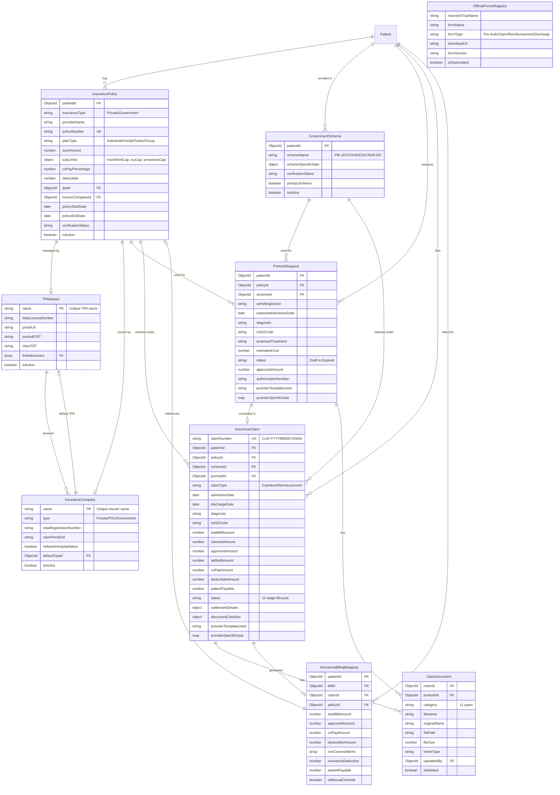

---

## 9. API Endpoints

All endpoints are mounted under `/api/insurance`.

### 9.1 Health Check

| Method | Endpoint | Description |
|---|---|---|
| `GET` | `/health` | Server health check (returns timestamp) |

### 9.2 Policy Routes (`/policies`)

| Method | Endpoint | Validation | Description |
|---|---|---|---|
| `POST` | `/` | `policyValidationRules` | Register new insurance policy |
| `GET` | `/:patientId` | — | Get all policies for a patient |
| `GET` | `/detail/:policyId` | — | Get single policy with TPA + insurer populated |
| `PUT` | `/:policyId` | `policyValidationRules` | Update policy details |
| `PATCH` | `/:policyId/verify` | — | Update verification status only |
| `DELETE` | `/:policyId` | — | Soft-delete policy (isActive = false) |

### 9.3 Scheme Routes (`/schemes`)

| Method | Endpoint | Validation | Description |
|---|---|---|---|
| `POST` | `/` | `schemeValidationRules` | Enroll patient in government scheme |
| `GET` | `/:patientId` | — | Get all scheme enrollments for a patient |
| `PUT` | `/:schemeId` | `schemeValidationRules` | Update scheme details |
| `PATCH` | `/:schemeId/verify` | — | Update verification status |

### 9.4 Pre-Auth Routes (`/pre-auth`)

| Method | Endpoint | Description |
|---|---|---|
| `POST` | `/` | Create pre-auth request (supports provider-specific forms) |
| `GET` | `/` | List all pre-auth requests (populated with patient + policy) |
| `GET` | `/:id` | Get single pre-auth detail |
| `PATCH` | `/:id/status` | Update status + approved amount + authorization number |

### 9.5 Claim Routes (`/claims`)

| Method | Endpoint | Description |
|---|---|---|
| `POST` | `/` | Create claim (auto-generates claim number, supports dynamic forms) |
| `GET` | `/` | List claims with pagination (`?status&page&limit`) |
| `GET` | `/dashboard-stats` | Aggregated dashboard statistics |
| `GET` | `/:id` | Get single claim (populated with patient, policy, scheme, documents) |
| `PATCH` | `/:id/status` | Update claim status with history tracking |

### 9.6 Document Routes (`/documents`)

| Method | Endpoint | Description |
|---|---|---|
| `POST` | `/upload` | Upload document (multipart, links to claim or pre-auth) |
| `GET` | `/claim/:claimId` | Get documents for a claim (non-deleted only) |
| `GET` | `/pre-auth/:preAuthId` | Get documents for a pre-auth (non-deleted only) |
| `DELETE` | `/:docId` | Soft-delete document |

### 9.7 Billing Integration Routes (`/billing`)

| Method | Endpoint | Description |
|---|---|---|
| `GET` | `/summary/:patientId` | Get insurance deduction summary for billing |
| `POST` | `/mapping` | Create billing-insurance mapping record |

### 9.8 Master Data Routes (`/master-data`)

| Method | Endpoint | Description |
|---|---|---|
| `GET` | `/tpas` | List all TPAs |
| `POST` | `/tpas` | Create new TPA |
| `GET` | `/companies` | List all insurance companies |
| `POST` | `/companies` | Create new insurance company |
| `GET` | `/forms` | List all official forms |
| `POST` | `/forms` | Create new official form |

### 9.9 Notification Routes (`/notifications`)

| Method | Endpoint | Description |
|---|---|---|
| `GET` | `/` | Get all notifications (currently mock data) |
| `PUT` | `/:id/read` | Mark notification as read |

**Total: 33 API endpoints across 9 sub-routes.**

---

## 10. Frontend Components

### 10.1 Main Insurance Page (`Insurance.jsx`)

The main Insurance Desk interface is a single-page application with 7 internal views managed by a `step` state variable.

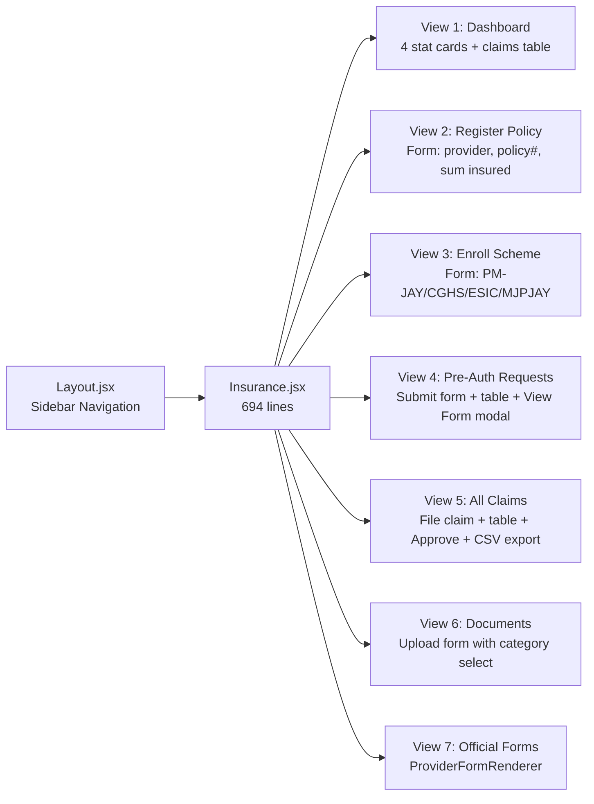

**Sidebar Navigation Buttons:**
- Dashboard
- Register Policy
- Enroll Scheme
- Pre-Auth Requests
- All Claims
- Documents
- Official Provider Forms

### 10.2 ProviderFormRenderer (`ProviderFormRenderer.jsx`)

A dynamic form engine that renders insurer-specific official forms based on template configuration.

- Dropdown to select template: IRDAI Standard, PM-JAY, CGHS
- Auto-fills fields from patient data
- Handles all field types: text, number, select, textarea, checkbox, file
- Submits to pre-auth or claim endpoints depending on mode
- Print-to-PDF support via `window.print()`

### 10.3 InsuranceSplitCard (`InsuranceSplitCard.jsx`)

Reusable billing integration component used by the Billing Module.

- Fetches `GET /api/insurance/billing/summary/:patientId`
- Displays breakdown: Gross Hospital Bill → Insurance Deduction → Co-Pay → Net Patient Payable

### 10.4 NotificationBell (`NotificationBell.jsx`)

- Polls `GET /api/insurance/notifications` every 30 seconds
- Dropdown with unread count badge
- Click marks notification as read

### 10.5 Form Templates (`insuranceFormTemplates.js`)

Three provider templates defined as configuration objects:

| Template ID | Name | Sections |
|---|---|---|
| `IRDAI_STANDARD` | IRDAI Standard Private Insurance | Patient Details, Policy Details, Medical Information, Financial Estimates |
| `PM_JAY` | Ayushman Bharat (PM-JAY) | Beneficiary Verification, Admission & Clinical Status, Package Selection & Evidence |
| `CGHS` | Central Government Health Scheme | Beneficiary Information, Medical & Billing Details |

---

## 11. Workflows

### 11.1 Policy & Scheme Registration Flow

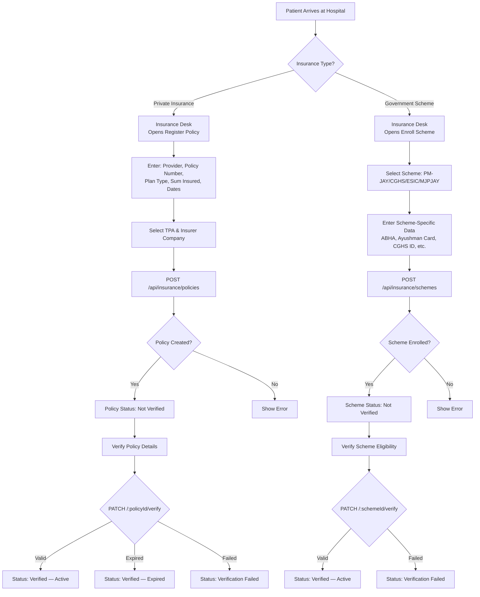

### 11.2 Pre-Authorization Workflow

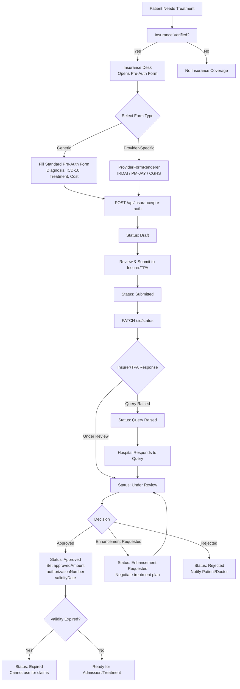

### 11.3 Claims Workflow

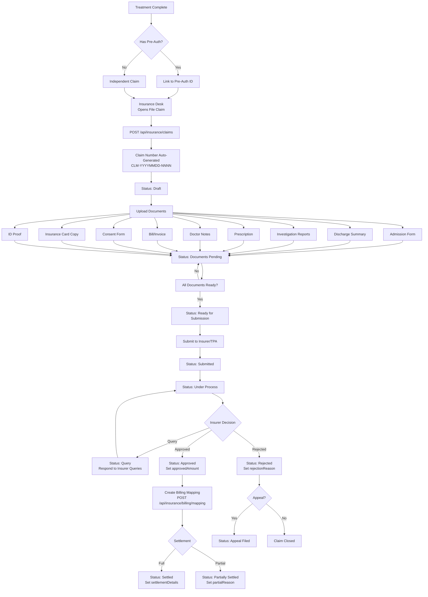

### 11.4 Billing Integration Flow

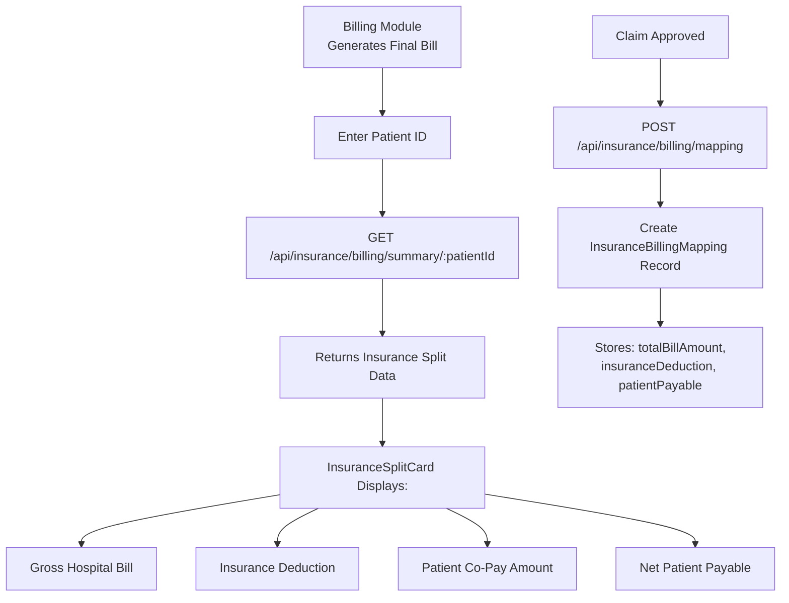

---

## 12. Diagrams

### 12.1 Flowchart Diagram

*The complete workflow flowcharts are documented in Section 11 above:*
- Policy & Scheme Registration Flow
- Pre-Authorization Workflow
- Claims Workflow
- Billing Integration Flow

### 12.2 Data Flow Diagram (DFD)

#### DFD Level 0 — Insurance System Context

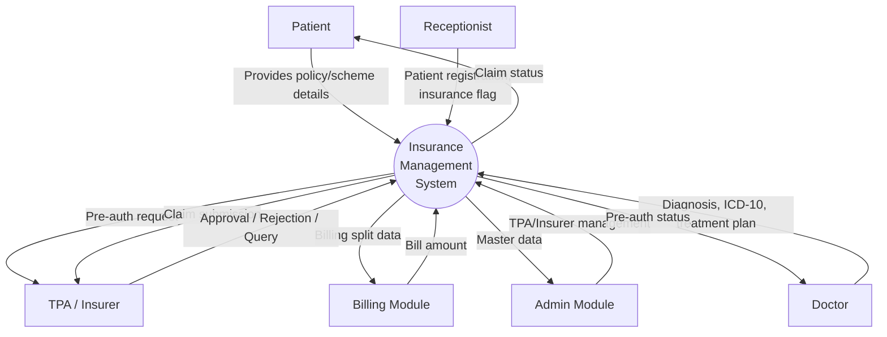

#### DFD Level 1 — Insurance Internal Processes

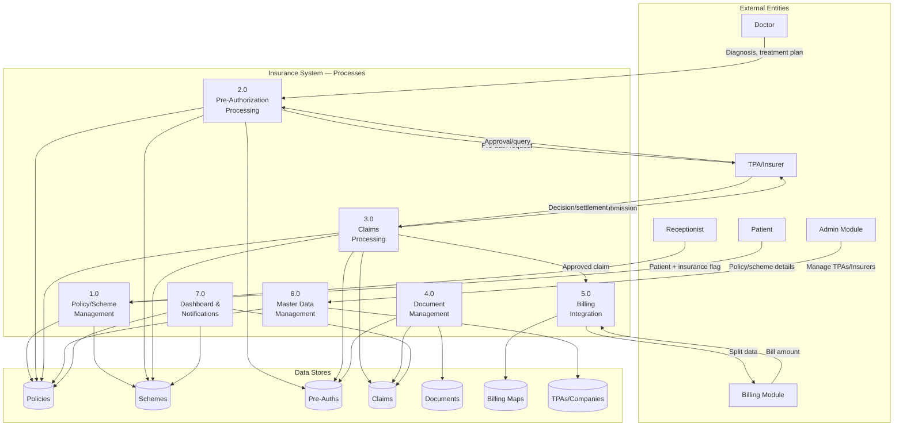

### 12.3 Use Case Diagram

```mermaid
graph TD
    subgraph "Insurance Module — Use Cases"
        UC1[Register Insurance Policy]
        UC2[Enroll Government Scheme]
        UC3[Verify Policy/Scheme]
        UC4[File Pre-Authorization Request]
        UC5[Submit Pre-Auth to Insurer]
        UC6[Respond to Insurer Queries]
        UC7[File Insurance Claim]
        UC8[Upload Claim Documents]
        UC9[Track Claim Status]
        UC10[Process Claim Settlement]
        UC11[View Insurance Dashboard]
        UC12[Manage TPA Master Data]
        UC13[Manage Insurance Companies]
        UC14[Manage Official Forms]
        UC15[Calculate Billing Split]
        UC16[View Notifications]
    end

    subgraph "Actors"
        INS_OFFICER[Insurance Desk Officer]
        ADMIN_USER[Admin]
        RECEPTIONIST[Receptionist]
        BILLING_OFFICER[Billing Officer]
        DOCTOR_ACTOR[Doctor]
        PATIENT_ACTOR[Patient]
        TPA_ACTOR[TPA / Insurer]
    end

    INS_OFFICER --> UC1
    INS_OFFICER --> UC2
    INS_OFFICER --> UC3
    INS_OFFICER --> UC4
    INS_OFFICER --> UC5
    INS_OFFICER --> UC6
    INS_OFFICER --> UC7
    INS_OFFICER --> UC8
    INS_OFFICER --> UC9
    INS_OFFICER --> UC10
    INS_OFFICER --> UC11
    INS_OFFICER --> UC16

    ADMIN_USER --> UC11
    ADMIN_USER --> UC12
    ADMIN_USER --> UC13
    ADMIN_USER --> UC14

    RECEPTIONIST --> UC4

    BILLING_OFFICER --> UC15

    DOCTOR_ACTOR --> UC4
    DOCTOR_ACTOR --> UC8

    PATIENT_ACTOR --> UC9

    TPA_ACTOR -.->|External| UC5
    TPA_ACTOR -.->|External| UC9
```

### 12.4 Sequence Diagram — Pre-Authorization Flow

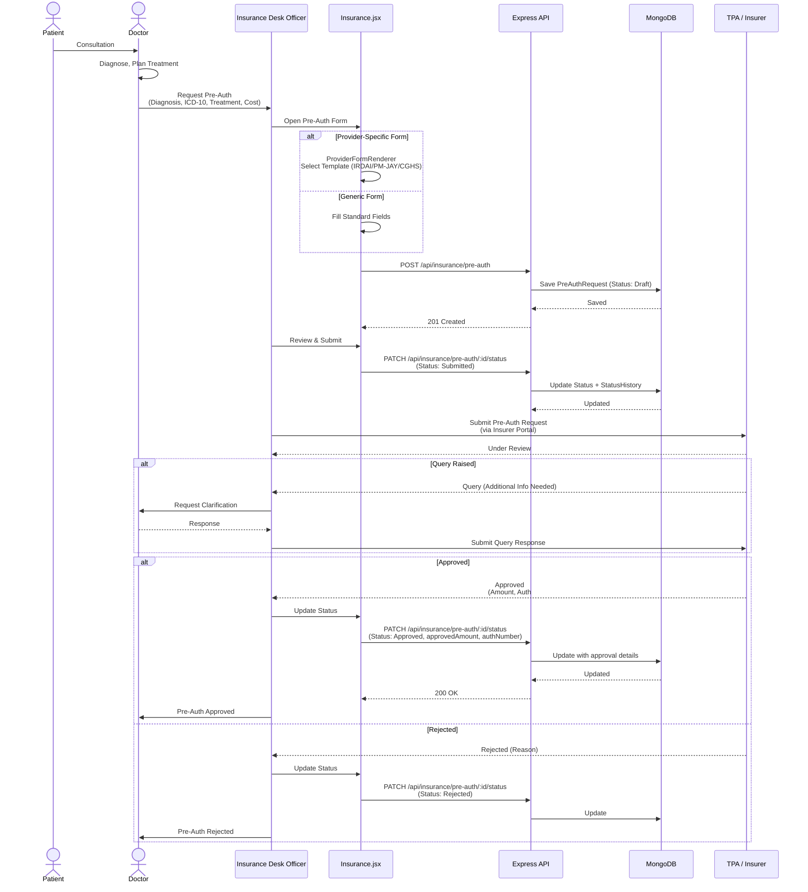

### 12.5 Sequence Diagram — Claim Processing Flow

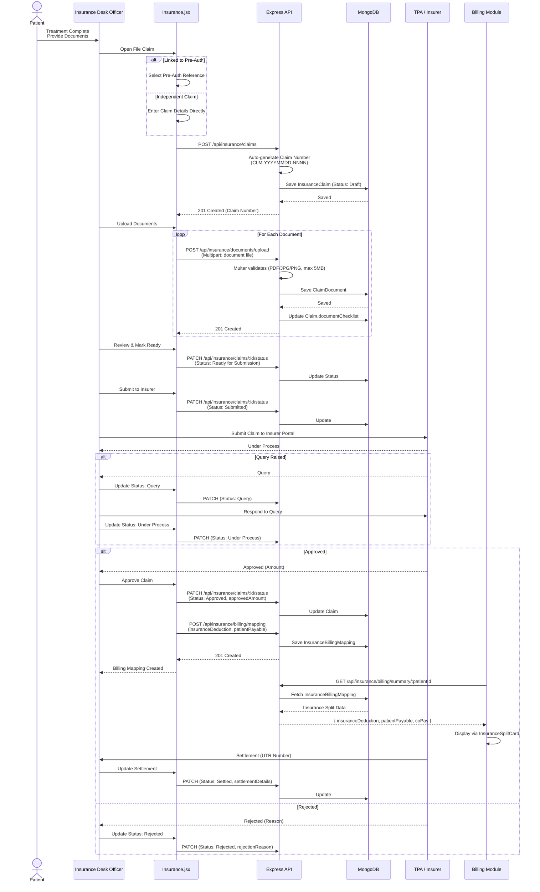

### 12.6 Module Interaction Diagram

```mermaid
graph TB
    subgraph "HMS Modules"
        RECEPT[Receptionist Module<br/>Namrata]
        ADMIN_M[Admin Module<br/>Sakshi]
        DOCTOR_M[Doctor Module<br/>Manisha]
        NURSE_M[Nurse Module<br/>Trupti]
        LAB_M[Lab Module<br/>Suhas]
        PHARMA_M[Pharmacy Module<br/>Vaishnavi]
        BILLING_M[Billing Module<br/>Prajwal]
        INSURANCE_M[Insurance Module<br/>Siddhant]
    end

    subgraph "Insurance Module Components"
        POLICIES[Policy Management]
        SCHEMES[Scheme Management]
        PREAUTH[Pre-Authorization]
        CLAIMS[Claims Processing]
        DOCUMENTS[Document Management]
        BILLING_INT[Billing Integration]
        MASTER[Master Data]
    end

    RECEPT -->|"POST /pre-auth<br/>(auto-create Draft)"| PREAUTH
    RECEPT -->|"Patient ID"| POLICIES
    RECEPT -->|"Patient ID"| SCHEMES

    ADMIN_M -->|"GET/POST /tpas<br/>GET/POST /companies"| MASTER
    ADMIN_M -->|"Insurance Master View"| MASTER

    DOCTOR_M -->|"Diagnosis, ICD-10<br/>Treatment Plan"| PREAUTH
    DOCTOR_M -->|"Clinical Documents"| DOCUMENTS

    NURSE_M -->|"Patient Reports"| DOCUMENTS
    LAB_M -->|"Lab Reports"| DOCUMENTS
    PHARMA_M -->|"Pharmacy Bills"| CLAIMS

    BILLING_M -->|"GET /billing/summary/:patientId"| BILLING_INT
    BILLING_M -->|"InsuranceSplitCard"| BILLING_INT

    INSURANCE_M --> POLICIES
    INSURANCE_M --> SCHEMES
    INSURANCE_M --> PREAUTH
    INSURANCE_M --> CLAIMS
    INSURANCE_M --> DOCUMENTS
    INSURANCE_M --> BILLING_INT
    INSURANCE_M --> MASTER
```

---

## 13. Integration Points

### 13.1 Reception ↔ Insurance

When a receptionist registers a patient with insurance, the system automatically creates a Draft pre-authorization request.

**Trigger:** Patient registration with `insurance: true` flag  
**API:** `POST /api/insurance/pre-auth`  
**Result:** PreAuthRequest saved with status "Draft" for insurance desk to process

### 13.2 Insurance ↔ Billing

When a claim is approved, the insurance module creates a billing mapping record. The billing module fetches this data to display insurance coverage splits.

**Trigger:** Claim status changed to "Approved"  
**API:** `POST /api/insurance/billing/mapping`  
**Consumer:** Billing Module via `GET /api/insurance/billing/summary/:patientId`  
**Frontend:** `InsuranceSplitCard.jsx` displays the breakdown

### 13.3 Admin ↔ Insurance

The Admin Module manages the master data that the Insurance Module depends on.

**API:** `GET /api/insurance/master-data/tpas`, `GET /api/insurance/master-data/companies`  
**Frontend:** Admin Dashboard → "Insurance Master" view

### 13.4 Doctor ↔ Insurance

Doctors initiate pre-auth requests and upload clinical documents.

**Flow:** Doctor Dashboard → Diagnosis → Request Pre-Auth → Insurance Module  
**Documents:** Clinical reports, prescriptions, investigation results

### 13.5 Pharmacy ↔ Insurance

Pharmacy bills are included in claim totals for insurance reimbursement.

**Flow:** Pharmacy generates bill → Bill included in claim total → Insurance processes

---

## 14. Technology Stack

| Layer | Technology | Version |
|---|---|---|
| **Frontend Framework** | React | 19.2.5 |
| **Routing** | React Router DOM | 7.15.0 |
| **HTTP Client** | Axios | 1.15.0 |
| **Backend Runtime** | Node.js | — |
| **Backend Framework** | Express | 5.2.1 |
| **Database** | MongoDB (Atlas) | — |
| **ODM** | Mongoose | 9.4.1 |
| **Validation** | express-validator | 7.3.2 |
| **File Upload** | Multer | 2.1.1 |
| **Authentication** | bcryptjs, jsonwebtoken | 3.0.3, 9.0.3 |
| **Environment** | dotenv | 17.4.1 |
| **CORS** | cors | 2.8.6 |
| **Dev Tools** | nodemon | 3.1.14 |

---

## 15. Setup & Configuration

### 15.1 Prerequisites

- Node.js (v18+)
- MongoDB Atlas account (or local MongoDB instance)
- npm or yarn

### 15.2 Backend Setup

```bash
# Navigate to backend
cd Backend

# Install dependencies
npm install

# Seed insurance master data (TPAs + Companies)
node seeds/insuranceSeed.js

# Start development server
npm run dev
```

Server runs on `http://localhost:5000`.

### 15.3 Frontend Setup

```bash
# Navigate to frontend
cd frontend

# Install dependencies
npm install

# Start development server
npm start
```

Frontend runs on `http://localhost:3000`.

### 15.4 MongoDB Collections

The insurance module uses these collections in the `hospitalDB` database:

| Collection | Purpose |
|---|---|
| `insurance_policies` | Private insurance policies |
| `government_schemes` | Government scheme enrollments |
| `pre_authorization_requests` | Pre-auth requests |
| `insurance_claims` | Cashless & reimbursement claims |
| `claim_documents` | Uploaded medical documents |
| `insurance_billing_mappings` | Insurance-billing split records |
| `tpa_master` | TPA registry |
| `insurance_companies` | Insurer registry |
| `official_forms_registry` | Official form directory |

### 15.5 Postman Collection

A pre-built Postman collection is available at:
`Backend/insurance-api.postman_collection.json`

---

## 16. Conclusion

The Insurance Module provides a comprehensive solution for managing hospital insurance operations. It handles the complete lifecycle from policy registration through pre-authorization, claims processing, and billing integration.

**Key Accomplishments:**
- 9 MongoDB collections fully implemented with proper relationships
- 33 API endpoints across 9 sub-routes
- Dynamic provider-specific form rendering (IRDAI, PM-JAY, CGHS)
- Full status lifecycle tracking with audit trails
- Cross-module integration with Reception, Billing, and Admin modules
- Insurance dashboard with real-time statistics

**Pending Items:**
- JWT authentication and RBAC middleware enforcement
- Real notification triggers (currently mock data)
- Analytics and reports module (6 planned report types)
- Dedicated reimbursement workflow enhancements
- Patient-facing insurance portal

---

**Document Version:** 1.0  
**Last Updated:** 14 May 2026  
**Author:** Siddhant Sangram Shinde  
**Module:** Insurance Module — Hospital Management System

